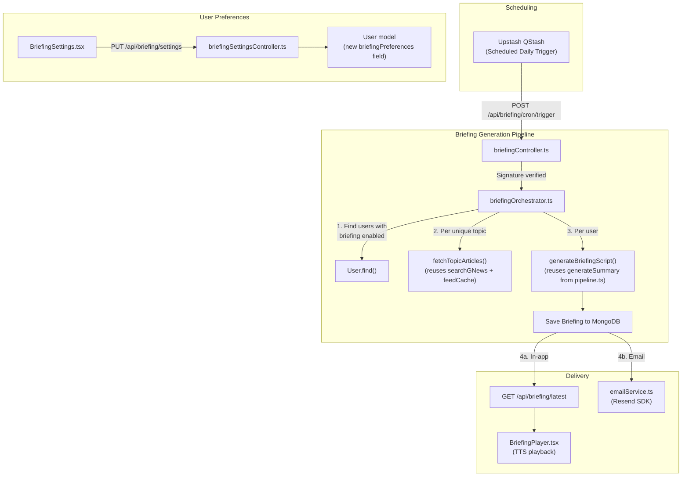

# Daily Voice Briefing + Email Delivery

This is the core differentiator feature (#3 in the priority list) that transforms Voice News Reader from voice-input-only to a full voice-output product. The user gets a personalized daily briefing assembled from their topic preferences, with in-app TTS playback and email delivery via Resend.

## Addressed User Feedback
- **Scheduling**: Swapped `node-cron` for **Upstash QStash**.
- **Delivery Time**: Fixed at 7:00 AM UTC (we will add time zones in a future update).
- **Briefing Depth**: We will proceed with **top 3 articles per topic**. This ensures the audio briefing remains concise (~2-3 minutes) and punchy.
- **Email Frequency**: **Daily-only**. We can add weekly digests later if users request them.
- **Clarification on GNews Quota (Is it still personal?)**: **Yes, it is 100% personal.** 
  - *How it works:* User A follows "Technology" and "Business". User B follows "Business" and "Sports". 
  - Instead of asking GNews for "Business" twice, we ask GNews for "Business" once and cache the top articles in Redis. 
  - Then, we use those cached articles to generate User A's custom "Tech + Business" briefing script, and User B's custom "Business + Sports" script. 
  - **Result:** Everyone gets a completely unique, personalized briefing, but we only hit the GNews API once per *topic*, not once per *user*. This protects your API quota perfectly.

---

## User Review Required

> [!IMPORTANT]
> **Resend API Key** — You'll need to sign up at [resend.com](https://resend.com), create an API key, and verify a sending domain. The key goes in `.env` as `RESEND_API_KEY`.

> [!IMPORTANT]
> **Upstash QStash Token** — Since we are using QStash, you'll need the `QSTASH_CURRENT_SIGNING_KEY` and `QSTASH_NEXT_SIGNING_KEY` from your Upstash console. We will use the `@upstash/qstash` SDK to verify that the incoming cron requests actually came from QStash and not a malicious actor.

---

## Architecture Overview



---

## Proposed Changes

### Data Layer — User Model Extension

#### [MODIFY] [User.ts](file:///c:/Users/risha/voice-news-reader/backend/src/models/User.ts)

Add a `briefingPreferences` subdocument to the existing User schema:

```typescript
const briefingPreferencesSchema = new mongoose.Schema({
    enabled: { type: Boolean, default: false },
    emailEnabled: { type: Boolean, default: false },
}, { _id: false });
```

*(Note: `deliveryHourUTC` and `articleCountPerTopic` were removed to keep it simple, as per the fixed time / fixed depth decision).*

---

### Data Layer — Briefing Model

#### [NEW] [Briefing.ts](file:///c:/Users/risha/voice-news-reader/backend/src/models/Briefing.ts)

A new Mongoose model to store generated briefings:

```typescript
// Key fields:
{
    userId: ObjectId (ref: 'User'),
    date: String (ISO date, e.g., '2026-07-14'),  // one per user per day
    topics: [String],  // which topics were included
    script: String,    // the full narration text (for TTS)
    sections: [{       // structured sections for the UI
        topic: String,
        summary: String,
        articles: [{ title, url, image, source, publishedAt }]
    }],
    emailSentAt: Date | null,  // null = not sent, Date = delivered
    createdAt: Date
}
```

---

### Service Layer — Briefing Generation

#### [NEW] [briefingService.ts](file:///c:/Users/risha/voice-news-reader/backend/src/services/briefingService.ts)

The core generation logic.

**Key functions:**

| Function | Purpose |
|----------|---------|
| `generateAllBriefings()` | Fetches all users with briefings enabled, gets all required topics, caches the news globally, and orchestrates generation. |
| `generateUserBriefing(userId)` | End-to-end for one user: fetch articles for user's topics → summarize each section → compose the narration script → save Briefing document |
| `fetchTopicArticles(topic)` | **Reuses** `searchGNews()` and `feedCache`. |
| `composeBriefingScript(sections[])` | **Reuses** `generateSummary()` per section, then stitches them into a full narration with transitions. |

---

### Service Layer — Email Delivery

#### [NEW] [emailService.ts](file:///c:/Users/risha/voice-news-reader/backend/src/services/emailService.ts)

Thin wrapper around the Resend SDK:

```typescript
import { Resend } from 'resend';
const resend = new Resend(process.env.RESEND_API_KEY);
export async function sendBriefingEmail(to: string, briefing: BriefingDocument): Promise<void> { ... }
```

#### [NEW] [emailTemplates.ts](file:///c:/Users/risha/voice-news-reader/backend/src/services/emailTemplates.ts)

A `renderBriefingEmail(briefing)` function that returns an inline-styled HTML email. 

---

### Scheduling Layer (QStash)

#### [NEW] [qstashMiddleware.ts](file:///c:/Users/risha/voice-news-reader/backend/src/middleware/qstashMiddleware.ts)

Middleware to verify that requests to our cron endpoint actually come from Upstash QStash.

```typescript
import { Receiver } from '@upstash/qstash';

const receiver = new Receiver({
  currentSigningKey: process.env.QSTASH_CURRENT_SIGNING_KEY!,
  nextSigningKey: process.env.QSTASH_NEXT_SIGNING_KEY!,
});

// Express middleware to verify QStash signature
```

---

### Controller Layer — Briefing API

#### [NEW] [briefingController.ts](file:///c:/Users/risha/voice-news-reader/backend/src/controllers/briefingController.ts)

| Endpoint | Method | Purpose |
|----------|--------|---------|
| `/api/briefing/latest` | GET | Returns the user's most recent briefing |
| `/api/briefing/generate` | POST | Manually triggers briefing generation for a single user (for testing or onboarding) |
| `/api/briefing/settings` | GET | Returns current briefing preferences |
| `/api/briefing/settings` | PUT | Updates briefing preferences (enable/disable, email toggle) |
| `/api/briefing/history` | GET | Returns past briefings |
| `/api/briefing/cron/trigger` | POST | **QStash Endpoint**: Triggers daily generation for all active users. Protected by QStash signature. |

#### [NEW] [briefing.ts](file:///c:/Users/risha/voice-news-reader/backend/src/routes/briefing.ts) (route file)

Standard Express router.

#### [MODIFY] [api.ts](file:///c:/Users/risha/voice-news-reader/backend/src/routes/api.ts)

Add: `router.use('/briefing', briefingRoutes);`

---

### Frontend — API Layer

#### [NEW] [briefing.ts](file:///c:/Users/risha/voice-news-reader/frontend/src/services/api/briefing.ts)

API client functions following the existing pattern in `client.ts`.

#### [MODIFY] [index.ts](file:///c:/Users/risha/voice-news-reader/frontend/src/services/api/index.ts)

Add: `export * from './briefing';`

---

### Frontend — Custom Hooks

#### [NEW] [useBriefing.ts](file:///c:/Users/risha/voice-news-reader/frontend/src/hooks/useBriefing.ts)

A hook that composes `react-query` + the existing `useAudioPlayer` hook. No new audio logic needed.

#### [NEW] [useBriefingSettings.ts](file:///c:/Users/risha/voice-news-reader/frontend/src/hooks/useBriefingSettings.ts)

React Query wrapper for the briefing settings CRUD.

---

### Frontend — Types & Validation

#### [MODIFY] [news.ts](file:///c:/Users/risha/voice-news-reader/frontend/src/types/news.ts)

Add new interfaces: `BriefingSection`, `Briefing`, `BriefingPreferences`.

#### [NEW] [briefingSchemas.ts](file:///c:/Users/risha/voice-news-reader/frontend/src/validation/schemas/briefingSchemas.ts)
#### [NEW] [briefingSchemas.ts](file:///c:/Users/risha/voice-news-reader/backend/src/validation/schemas/briefingSchemas.ts)

Zod schemas for validating briefing API responses and requests.

---

### Frontend — Pages & Components

#### [NEW] [Briefing.tsx](file:///c:/Users/risha/voice-news-reader/frontend/src/pages/Briefing.tsx)

The main briefing page. Layout:

```
┌─────────────────────────────────────────┐
│  📰 Your Daily Briefing — July 14, 2026│
│  "Good morning! Here's your briefing"  │
│                                         │
│  ▶ Play Full Briefing  ⏸ ■  ⚙️ Settings│
│                                         │
│  ┌─── Technology ─────────────────────┐ │
│  │ Summary text here...               │ │
│  │ ▶ Play Section                     │ │
│  │ ┌─────┐ ┌─────┐ ┌─────┐          │ │
│  │ │Art 1│ │Art 2│ │Art 3│          │ │
│  │ └─────┘ └─────┘ └─────┘          │ │
│  └────────────────────────────────────┘ │
│                                         │
│  ── Previous Briefings ──               │
│  📅 July 13  📅 July 12  📅 July 11   │
└─────────────────────────────────────────┘
```

Key components to extract:
- `BriefingPlayer.tsx`
- `BriefingSection.tsx`
- `BriefingSettings.tsx`
- `BriefingHistoryList.tsx`

#### [MODIFY] [App.tsx](file:///c:/Users/risha/voice-news-reader/frontend/src/App.tsx)
#### [MODIFY] [Sidebar.tsx](file:///c:/Users/risha/voice-news-reader/frontend/src/components/ui/Sidebar.tsx)

---

### Dependencies

#### Backend:
- `resend` — Resend SDK for email delivery
- `@upstash/qstash` — For QStash webhook verification

#### Frontend:
- No new dependencies.

---

## Build Order

### Phase A: Data + Service Layer (Backend foundation)
1. Install `resend` and `@upstash/qstash` dependencies
2. `Briefing.ts` model
3. `User.ts` model update
4. `briefingService.ts` (generation logic)
5. `emailService.ts` + `emailTemplates.ts`

### Phase B: API + Scheduling (Backend complete)
6. `qstashMiddleware.ts`
7. `briefingSchemas.ts` (backend validation)
8. `briefingController.ts`
9. `briefing.ts` route + register in `api.ts`

### Phase C: Frontend Integration
10. Types + validation schemas (frontend)
11. API client functions
12. `useBriefing.ts` + `useBriefingSettings.ts` hooks
13. Components (`BriefingPlayer.tsx`, etc)
14. `Briefing.tsx` page + Router + Sidebar updates
