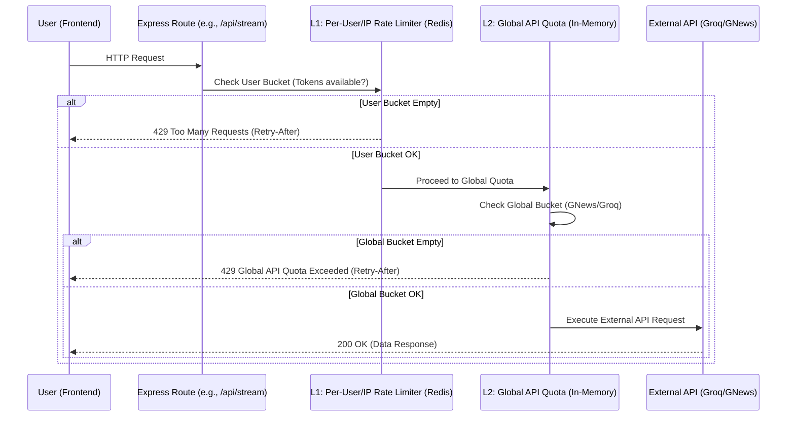

# Rate Limiting Implementation Report

## Overview
The Voice News Reader application employs a **two-layered rate limiting architecture** using the **Token Bucket** algorithm. This ensures fair usage across individual users while simultaneously protecting our external API keys (Groq, GNews) from being exhausted by global spikes in traffic.

## Terminology & Technical Concepts

- **Token Bucket Algorithm**: A common algorithm used for rate limiting. Imagine a bucket that holds a maximum number of "tokens". Each time a request is made, one token is removed from the bucket. If the bucket is empty, the request is rejected.
- **Tokens**: Represents the currency for making requests. 1 Token = 1 Allowed Request.
- **Capacity (or Burst Capacity)**: The maximum number of tokens a bucket can hold at any given time. This dictates the maximum number of burst requests a user can make simultaneously before hitting limits.
- **Refill Rate**: The rate at which new tokens are added back into the bucket over time (e.g., tokens per second). 
- **Window (`windowSeconds`)**: The timeframe over which the base rate limit is calculated. For example, a limit of 5 requests per 60 seconds.
- **`perUser`**: The number of requests allowed per user within the defined `windowSeconds`.
- **Calculations**:
  - `refillRate = perUser / windowSeconds`
  - `capacity = burst || Math.ceil(perUser * 1.5)` (By default, the burst capacity is 1.5x the base limit).

## Request Flow Diagram

## 1. Per-User / Per-IP Rate Limits (L1)
Implemented in `rateLimiter.ts` using Redis. This tracks usage per individual user ID (or IP address for unauthenticated routes). It ensures no single user can spam the server.

### Redis Keys Created

The rate limiter creates keys in Redis to store the state of each bucket. The keys follow these naming conventions:

- **Authenticated Users**: `rl:user:{userId}:{resource}`
  - Example: `rl:user:64b9a1c2e4f5a3001c8b4567:/api/stream`
  - Details: Used when a valid JWT token is provided. Tracks limits per logged-in user ID.
- **Unauthenticated Users (IP Based)**: `rl:ip:{ipAddress}:{resource}`
  - Example: `rl:ip:192.168.1.100:/api/auth`
  - Details: Used for routes like `/api/auth` or as a fallback if the user ID is missing.

Each key stores a Redis Hash (`HMSET`) containing:
- `tokens`: The current number of tokens remaining (stringified float).
- `lastRefill`: The timestamp (in milliseconds) of the last token refill.

Redis keys automatically expire (using `EXPIRE`) after `capacity / refillRate` seconds, keeping the database clean without background cron jobs.

### Standard Rate Limit Headers
Returned with every request to inform the frontend of its limits:
- `X-RateLimit-Limit`: The base `perUser` limit.
- `X-RateLimit-Remaining`: The floored integer of remaining tokens.
- `X-RateLimit-Reset`: The UNIX timestamp (in seconds) when the bucket will be completely full again.
- `Retry-After`: (On 429 errors) The number of seconds the client must wait before making the next request.

### Configured Routes and Limits:
| Route | Limit (`perUser`) | Window (`windowSeconds`) | Burst Capacity (`capacity`) | Applied By |
| :--- | :--- | :--- | :--- | :--- |
| `/api/auth` | 5 req | 60s | 8 | IP Address |
| `/api/transcribe` | 5 req | 60s | 8 | User ID |
| `/api/feed` | 6 req | 60s | 10 | User ID |
| `/api/stream` | 10 req | 60s | 15 | User ID |
| `/api/intent` | 10 req | 60s | 15 | User ID |
| `/api/reader` | 15 req | 60s | 20 | User ID |
| `/api/collections` | 20 req | 60s | 25 | User ID |
| `/api/saved-articles`| 30 req | 60s | 40 | User ID |
| `/api/history` | 30 req | 60s | 40 | User ID |

## 2. Global API Quotas (L2)
Implemented in `globalQuota.ts`. Even if individual users are within their personal limits, the server must track total overall calls made to external paid APIs to avoid exhausting our daily/hourly limits.

### Configured Global Quotas:
| External API | Global Limit | Refill Rate | Affected Routes |
| :--- | :--- | :--- | :--- |
| **GNews API** | 80 requests | ~80 / hour | `/api/feed` |
| **Groq LLM** | 200 requests | ~200 / hour | `/api/transcribe`, `/api/stream`, `/api/intent` |

These use an in-memory `Map` (since global quotas represent the global state of the backend instance). If a global bucket empties out, the server returns a `429` error specifying that the *Global API quota was exceeded*, providing a `Retry-After` value calculated based on the global refill rate.

## 3. Practical Examples

### Example 1: Standard API Call (Within Limits)
1. User requests `/api/stream`.
2. Backend checks `rl:user:123:/api/stream` in Redis.
3. The bucket has 10 tokens. 1 is deducted (9 remaining).
4. Headers sent back:
   - `X-RateLimit-Limit: 10`
   - `X-RateLimit-Remaining: 9`
   - `X-RateLimit-Reset: 1679000100`

### Example 2: Sustained Burst (Hitting the Limit)
1. User spams 16 requests to `/api/stream` within a second.
2. The burst capacity is 15. The first 15 requests succeed (tokens drop to 0).
3. The 16th request is rejected by the Redis Lua script because `tokens < 1`.
4. The server responds with `429 Too Many Requests`.
5. The `Retry-After` header tells the client exactly how many seconds to wait until at least 1 token is refilled (based on `refillRate` of 10/60s = ~0.16 tokens/sec). The client must wait ~6 seconds.

### Example 3: Global Quota Exhausted
1. 20 different users each make 10 requests to `/api/stream`. (Total 200 requests).
2. Every user passes the Redis L1 rate limit.
3. The global in-memory bucket for `groq` drops from 200 tokens to 0.
4. The next user requests `/api/stream` and passes L1.
5. The L2 `globalQuota.ts` middleware sees the `groq` bucket has 0 tokens.
6. The request is rejected with `429 Global API quota exceeded for groq` and a `Retry-After` header representing when the global bucket will gain 1 token (~18 seconds based on 200/3600 refill rate).
