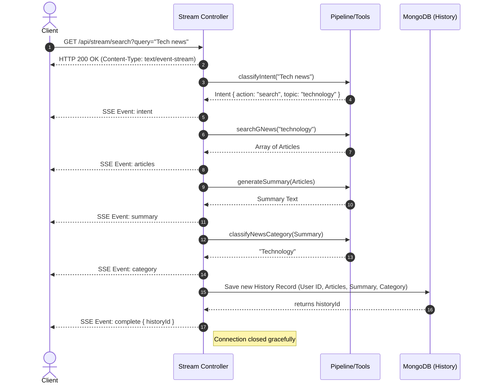

# Server-Sent Events (SSE) Implementation Report

This report outlines how Server-Sent Events (SSE) were implemented in the `voice-news-reader` project, the role of `useReducer`, common SSE syntaxes, and the lifecycle of a request from client to database.

## 1. How we implemented SSE

Our SSE architecture allows the backend to stream real-time updates to the frontend as the LLM pipeline progresses through different stages (intent classification, fetching news, summarizing, etc.).

### Backend Implementation (`streamController.ts`)
The backend exposes a single endpoint that establishes the stream. Instead of sending a single JSON response, it keeps the connection open.
- **Headers:** We set specific HTTP headers to tell the client and intermediate proxies that this is a continuous stream:
  ```typescript
  res.writeHead(200, {
      'Content-Type': 'text/event-stream',
      'Cache-Control': 'no-cache',
      'Connection': 'keep-alive',
      'X-Accel-Buffering': 'no', // Disables nginx buffering
  });
  ```
- **Event Formatting:** We use a helper function to send formatted messages conforming to the SSE standard:
  ```typescript
  const sendEvent = (event: string, data: object) => {
      res.write(`event: ${event}\ndata: ${JSON.stringify(data)}\n\n`);
  };
  ```
- **Heartbeats:** To prevent the connection from dropping prematurely due to inactivity (e.g., waiting for the LLM), we send a periodic heartbeat `setInterval(() => res.write(': ping\n\n'), 15000);`.
- **Client Disconnects:** We listen for `req.on('close')` to set an `aborted` flag, stopping expensive LLM tasks if the user closes the page early.

### Frontend Implementation (`useSSESearch.ts`)
Instead of using the native browser `EventSource` API (which lacks support for custom headers like `Authorization`), we use the native `fetch` API and manually read the response stream.
- **Stream Reading:** We get a reader from the response body (`response.body.getReader()`) and read the stream chunk by chunk.
- **Decoding:** We use `TextDecoder` to convert binary chunks into strings.
- **Parsing:** We manually split the incoming text by `\n\n` to separate events, and then parse the `event:` and `data:` fields to trigger the correct UI updates.

---

## 2. What is `useReducer` and how did we use it?

### What is `useReducer`?
`useReducer` is a React Hook used for state management. It is an alternative to `useState` that is heavily inspired by Redux. It is ideal for complex state logic that involves multiple sub-values or when the next state depends on the previous state. Instead of directly updating the state, you `dispatch` an **action**, and a **reducer function** calculates the new state based on the action type.

### How we used it in `useSSESearch`
Processing an SSE stream involves a lot of moving parts. A single search request moves through multiple stages (`connecting` -> `intent` -> `articles` -> `summary` -> `category` -> `complete`), and we need to store data for each stage.

Instead of having 6-7 different `useState` hooks (which can lead to race conditions or out-of-sync renders), we centralized the state:
```typescript
interface SSESearchState {
    stage: PipelineStage;
    intent: object | null;
    articles: Article[];
    summary: string;
    // ...
}
```
When a new event arrives over the SSE stream, we dispatch an action (e.g., `dispatch({ type: 'EVENT_SUMMARY', payload: { text: "..." } })`). The reducer then safely updates *only* the summary part of the state and changes the current `stage` to 'summary'.

---

## 3. Common Syntaxes used for SSE

The SSE format is text-based and very strict. Messages are separated by double newline characters (`\n\n`).

1. **Basic Data Message:**
   ```text
   data: {"message": "Hello World"}
   
   ```
2. **Named Events (What we use):**
   Allows the client to distinguish between different types of messages.
   ```text
   event: summary
   data: {"text": "This is the news summary..."}
   
   ```
3. **Comments / Heartbeats:**
   Lines starting with a colon `:` are ignored by the client. We use this to keep the connection alive.
   ```text
   : ping
   
   ```
4. **Multiline Data:**
   You can send multiple `data:` lines for a single event.
   ```text
   data: first line
   data: second line
   
   ```

---

## 4. Flow from Request to Database (Flow Diagram)

The following diagram maps out how a user's search query progresses through the backend pipeline, streaming events back to the client at each step, and finally saving the result to the MongoDB database.


